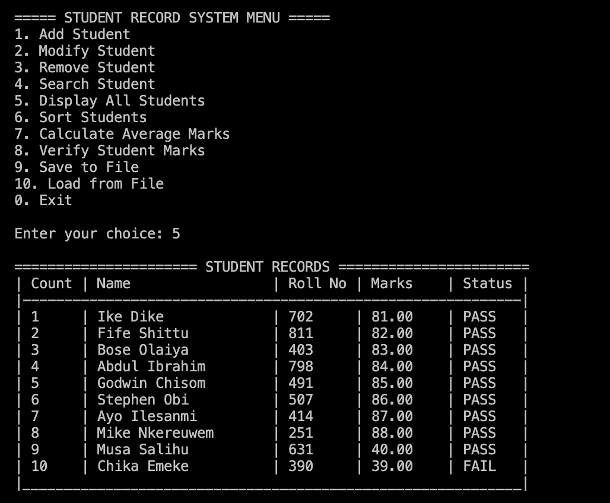

# Student Record System

An interactive C (C11) console application for MIVA Openn University's COS 201 lab work. The menu-driven workflow keeps every input line under tight validation so users can safely manage student records, snapshot them to disk, and restore them later without corrupting data.

## Feature Overview

- **Full CRUD**: add, modify, remove, search, display, and sort student records.
- **Robust input parsing**: all input passes through `fgets`-based helpers that trim whitespace, detect invalid characters, and guard against stray characters lingering in stdin.
- **Unique roll numbers**: duplicates are rejected whether you're creating a new student or editing an existing one, so no record gets overwritten by accident.
- **PASS/FAIL feedback**: any marks entry (or the separate verification menu item) announces status immediately.
- **Flexible persistence**: save or load from any filename you type when prompted, making it easy to keep multiple snapshots.

## Quick Start

Clone/open the repository, then build and run from the `student_record_system` directory:

```bash
make
./student
```

You'll be greeted, shown the menu, and walked through each field. Choose **0** to exit cleanly; `free_system` releases the dynamic array on the way out.

## Menu Cheat Sheet

| Option | Description |
| ------ | ----------- |
| 1 | Add student (validates name, unique roll number, and marks) |
| 2 | Modify existing student by roll number, with optional roll change |
| 3 | Remove student by roll number |
| 4 | Search for a specific student and display details |
| 5 | Display all students in a table |
| 6 | Sort students by marks (ascending/descending) and show the result |
| 7 | Calculate and print the class average |
| 8 | Verify arbitrary marks (PASS/FAIL helper) |
| 9 | Save roster to a filename you enter |
| 10 | Load roster from a filename you enter |
| 0 | Exit the program |

## Output Sample Evidence

Seeing the layout helps: after adding a few demo students, choosing option **5** renders the table below in your terminal.



## Validation Rules

- **Names**: must contain at least one alphabetic character. Only letters (`A-Z`, `a-z`), spaces, and dashes are accepted.
- **Roll numbers**: integers ≥ 0. If a roll already exists in the system, the operation is rejected and the user is prompted again.
- **Marks**: floats between 0 and 100. Out-of-range values trigger reprompts, and PASS/FAIL is reported instantly.
- **EOF/Ctrl+D**: gracefully cancels the current prompt, leaving the program in a consistent state.

## Save/Load Format

Saved files are plain text:

1. First line: number of students.
2. Repeated for each student (three lines): name, roll number, marks.

Loading expects exactly that structure. Feel free to keep multiple backups by entering different filenames (e.g., `semester_a.txt`, `semester_b.txt`).

## Code Structure

- **Data model**: `StudentSystem` stores a dynamically sized array of `Student` structs. Capacity doubles when needed, preventing O(n²) copying and avoiding linked-list overhead.  
- **Entry point (`main.c`)** keeps the program loop tiny on purpose. It delegates every real action to the API exposed in `student.h` header file, so the UI can change independently from the data layer.  
- **Core module (`student.c`)** groups functionality by responsibility:  
  - *Starter utilities* (`greet_user`, `get_menu_choice`) handle user experience, while *memory management* helpers (`init_system`, `resize_system`, `free_system`) encapsulate dynamic-array behavior.  
  - *Input helpers* (`trim`, `read_line`, `read_int_range`, `read_float_range`, `read_name`) form a reusable safety net. All high-level features rely on these helpers, keeping validation logic consistent everywhere.  
  - *Core features* (`add_student`, `modify_student`, `remove_student`, `search_student`, `display_students`, `search_student`) interact directly with the `StudentSystem` struct. Each function owns exactly one menu action, which makes debugging and testing straightforward.  
  - *Algorithms* (sorting callback functions, `calculate_average`, `verify_marks`) remain pure or near-pure functions, so they’re easy to reuse and reason about.  
  - *File operators* (`save_to_file` annd `load_from_file`) take filename as user input and open a file pointer to the named file in write or read mode respectively, handling I/O errors gracefully and ensuring data persistence.  
- **I/O strategy**: everything is read with `fgets` into bounded buffers, then parsed with `strtol`/`strtof`. This guarantees leftover characters don’t pollute subsequent prompts and keeps the program resilient to malformed input.

## Maintenance & Development

- `make clean` removes compiled objects/binaries if you want a fresh build.
- The code compiles with GCC or Clang on macOS/Linux (`-std=c11`).
- For leak checks, run under Valgrind or rebuild with AddressSanitizer (`-fsanitize=address`) if available.
- All logic resides in `student.c`/`student.h` with `main.c` driving the menu loop; contribute changes there as needed.
